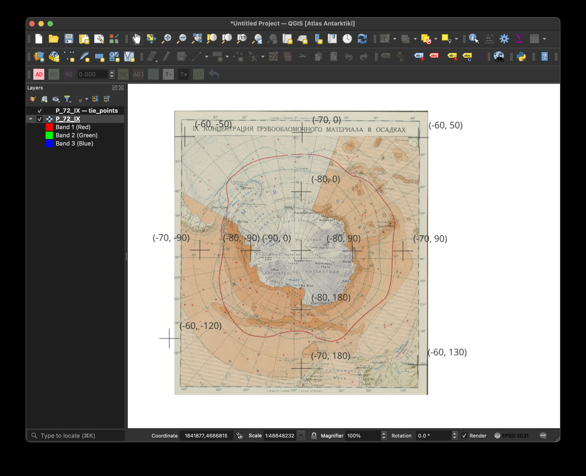
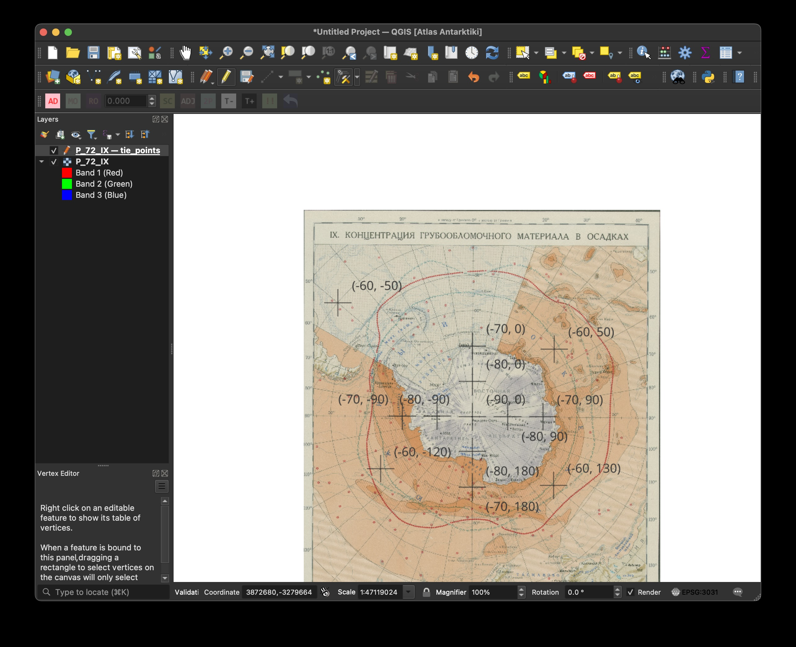

# Georeferencing

This document describes how to place tie points for georeferencing scanned maps in the atlas compilation. You only need to position and attribute the tie points in QGIS — a script will later use these points to warp the rasters automatically.

## Directory Structure

Maps are stored following this path convention:

```
Atlas/Part/Section/Subsection/maps/
```

For example:

```
atlas/2_general/6_geology_and_relief/23_relief_and_bottom_sediments_p_64-72/maps/P_64-65_Ib
```

Each map has a companion subdirectory with the suffix `_georeferencing`:

```
atlas/2_general/6_geology_and_relief/23_relief_and_bottom_sediments_p_64-72/maps/P_64-65_Ib_georeferencing
```

## Files in the `_georeferencing` Directory

Inside each `_georeferencing` directory you will find at least two files sharing the same base name:

| File | Description |
|------|-------------|
| **GeoTIFF raster** (`.tif`) | The scanned map image. It has a dummy georeference centred on the South Pole — this is just a placeholder so it can be loaded in QGIS. |
| **Point vector file** (`.gpkg`) | A GeoPackage containing tie points to be positioned on the map. Each point has `lat` and `lon` attribute fields that hold the true geographic coordinates. |
| Log file(s) | Analysis output from the georeferencing script. You can ignore these. |

## Instructions

### 1. Open the layers in QGIS

Open both the GeoTIFF raster and the GeoPackage point layer from the same `_georeferencing` directory. They share the same base name, so they are easy to identify as a pair.

> **CRS:** The project and layers use **EPSG:3031 (Antarctic Polar Stereographic)**. Make sure your QGIS project CRS is set accordingly.

The tie points are displayed as crosshairs, each labelled with its geographic coordinates as *(lat, lon)*.

### 2. Start editing the point layer

Select the point layer in the **Layers** panel, then click the **Toggle Editing** (pencil) button in the toolbar to enter edit mode.



### 3. Adjust the tie points

Your goal is to place tie points precisely on identifiable locations in the map — typically where grid lines intersect.

**For continental-scale maps:** the default points are usually close enough that you can simply drag them to the correct grid intersections.

**For regional or local-scale maps:** it is often easier to delete all default points and create new ones from scratch.

#### Moving an existing point

1. Select the **Vertex Tool** or **Move Feature** tool.
2. Click on a point and drag it to the correct position on the map grid.

#### Deleting a point

1. Select the point with the **Select Features** tool.
2. Press **Delete** or use **Edit → Delete Selected**.

#### Adding a new point

1. Select the **Add Point Feature** tool.
2. Click on a grid intersection (or other identifiable coordinate location) on the map.
3. In the attribute form that appears, enter the correct **`lat`** and **`lon`** values by reading them from the map's printed grid or graticule.

> **Important:** When adding new points, you *must* type in the correct `lat` and `lon` attribute values. These are the true geographic coordinates that the georeferencing script uses. Read them directly from the grid labels on the map.



### 4. Aim for good coverage

- Place **at least 5 tie points** for most maps. For small-scale or local maps where fewer grid intersections are visible, 3 points may suffice.
- **Spread the points across the full extent of the map.** Avoid clustering them in one area — the georeferencing quality depends on even spatial distribution.
- Position each point as precisely as you can on the grid intersection or coordinate marker.

### 5. Save and stop editing

When you are satisfied with the tie point placement:

1. Click **Toggle Editing** (pencil) again to stop editing.
2. When prompted, **save your edits**.

That's all! The next time the georeferencing script runs, it will pick up your updated tie points, warp the raster, and log the results.
